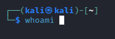
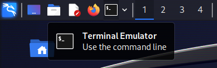
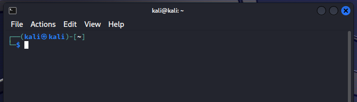
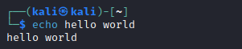
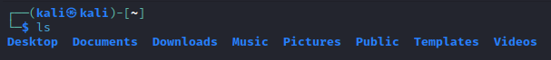
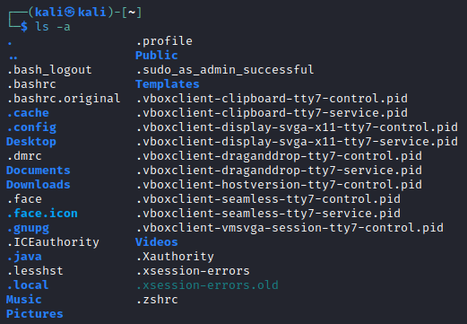
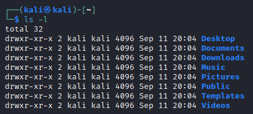
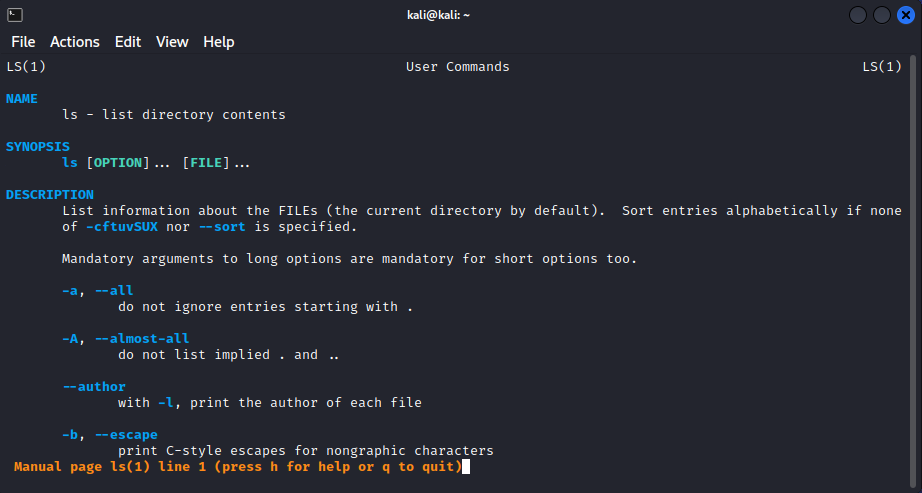

# Linux Basics

Now that you have a Linux virtual machine set up, let's get cooking on the command-line.



<!-- more -->

[*Haven't set up a virtual machine yet? Click me!*](../setting-up-kali/setting-up-kali.md)

## Why?

Linux is used everywhere in the field of cybersecurity. Why? Because it's useful. Its usefulness has led to a thriving ecosystem of people and software. This is why so many of the tools we will use have been developed for Linux, and why we continue to use it.
## Overview

A quick reference guide and overview of the Linux filesystem.

## Commands

Arguably, the most important part of Linux is the commands. Commands allow for quick and extensible usage of programs installed on the system.

There are commands for listing files, making web requests, editing users, shutting down the system, and this list goes on. Practically everything in Linux can be done using commands, as long as you have the correct commands installed, and permissions to do so.

### Hello World

First, open a terminal in your virtual machine. In Kali, you can do this by clicking the Terminal icon in the top-left of the desktop.




We will start off by looking at the `echo` command. This command simply echoes the provided text back to the output. For example, `echo hello world` will simply print `hello world`.



There are two parts to this command:

1. `echo`: The command itself.
2. `hello world`: The arguments/parameters passed to the command. In this case, the parameter is simply text we want to be printed.

What are parameters? They're important as they allow us to tune the functions of a command. We will look more into parameters soon.

### Input, Output, and Piping

With the `echo` command, whatever input we provide (as a parameter) gets written to the output. What exactly is happening here though? We are providing a parameter, and the `echo` command is writing that text to the output *stream*, also known as *stdout* (standard output).

Streams are basically channels that data is written to and read from. There are three standard streams in Linux:
- standard input (stdin)
- standard output (stdout)
- standard error (stderr)

There are also streams for reading from and writing to files.

We can *pipe* the `echo` command's output (stdout) to a file using the `>` operator. `echo hello world > my_file` would write the text "hello world" to the `my_file` file.

Piping using the `|` operator comes in handy when you wish to combine commands. For example, let's say you have a command `my_command` that results in a very large output. You can search this command's output using the `grep` command. Running the full command as `my_command | grep pattern`, you are running `my_command`, piping its output to `grep`'s input, and then `grep` only prints lines with `pattern`.

There are more advanced ways in which you can use the piping operators (`|`, `>`, `<`) to combine the functions of commands. This is just a simple introduction to help you when you encounter these in the wild.

### More Parameters

Parameters allow us to tune what a command does. For example, the `ls` command lists the files and directories within the current directory.

Another important command is `ls`, which lists files and sub-directories in the current directory.



One parameter available for the `ls` command is `-a`. The `-a` parameter prints hidden files, which are files in Linux that start with a `.` character.



Another parameter for the `ls` command is `-l`, which prints one entry per line. The `-l` parameter also outputs the file permissions, file size, and last write date for reach file.



Commands usually allow multiple parameters, and we can combine the `-l` and `-a` parameters in this case: `ls -l -a`. When parameters start with a dash (`-`), they can often be combined into one as well: `ls -la` (this is not always the case).

How can we find these parameters and unlock the functionality of commands? There are two ways usually:
- `man <command>`: The `man` command allows us to view the manual for a given command. `man ls` will give us a complete overview of the `ls` command.
- `<command> --help` or `<command> -h`: Running a command with the `--help`/`-h` argument often displays a brief help text.

The `man` command is a very important and very helpful tool, so we will look more into it.

### More Commands

[A cheatsheet for the different commands is provided below.](#commands-1)

#### sudo

The `sudo` command allows you to execute commands as different users. The most common usage is to run commands as the `root` user. When you use the `sudo` command, you will be prompted for your password before having your privileges elevated.

Examples:

- `sudo whoami`: This command, after entering your password, will output `root`.
- `sudo apt update`: This command will run `apt update` as the `root` user.

#### man

The `man` command displays the reference manual for a given command. For example, `man ls` will show you the manual for the `ls` command.

When the manual opens up, you will notice you can no longer run commands. Your keyboard is now tied to the controls of the manual. This is common among some commands, and allows for greater interactivity. Another command that does this is `nano`, which is a text-editor we will look at later.

There are several useful controls you can do:
- Using the arrow keys, you can now scroll through the manual.
- Pressing `q` will exit the manual.
- Pressing `h` will show the help page for controls.
- Pressing `/<pattern>` will search for a certain pattern. For example, if you want to read more about the `-l` parameter, you can type `/-l` + *Enter*. Instead of typing the whole pattern again, simply type `/` + *Enter* to search for the next occurrence.

Note: These are the same controls as used with the `less` command.



#### ls

The `ls` command lists files and directories in the specified directory. If no directory is specified, it will use the current directory. As mentioned earlier, there are many useful options available:
- `-a`: Show hidden files and directories (files/directories starting with `.`).
- `-l`: Show in list format, includes file permissions, date modified, and file size in output.
- `-R`: List files and directories recursively (lists everything in specified directory, and its child directories... so on).

Examples:
- `ls`: List files and directories in the current directory.
- `ls /`: List files and directories in the root (`/`) directory.
- `ls -la /`: List files and directories (including hidden), in the root (`/`) directory, in list format.

#### cd

The `cd` command changes your current directory.

Examples:

| Command       | Old Current Directory | New Current Directory | Description                                                                         |
| ------------- | --------------------- | --------------------- | ----------------------------------------------------------------------------------- |
| `cd my_dir`   | `/home/kali`         | `/home/kali/my_dir`  | Change your current directory to the relative directory of `my_dir`.                |
| `cd ./my_dir` | `/home/kali`         | `/home/kali/my_dir`  | Same as above.                                                                      |
| `cd /tmp`     | `/home/kali`         | `/tmp`               | Change your current directory to the absolute directory of `/tmp`.                  | 
| `cd ..`       | `/home/kali`         | `/home`              | Change your directory to the parent directory.                                      |
| `cd .`        | `/home/kali`         | `/home/kali`         | Changes your current directory to the current directory (does practically nothing). |

#### mkdir

The `mkdir` command makes a new directory.

A useful parameter of `mkdir` is the `-p` parameter, which enables creating a new directory within a new directory and so on. This parameter also avoids errors when creating a directory that may already exist.

Examples:
- `mkdir my_dir`: Creates a new directory called `my_dir`.
- `mkdir -p my_dir/my_dir_2`: Creates a new directory called `my_dir`, and a new directory inside `my_dir` called `my_dir2`.
- `mkdir -p my_dir/my_dir_2/my_dir_3`: Creates a new directory called `my_dir`, then `my_dir_2` inside `my_dir`, then `my_dir_3` inside `my_dir/my_dir_2`.

#### echo

The `echo` command simply echoes the input text back to the output.

Examples:
- `echo hello world`: Writes `hello world` to the output.
- `echo hello world > my_file`: Writes `hello world` into `my_file`.

#### touch

The `touch` command creates a file if it does not exist, and does nothing if the file does exist. This is useful for testing file access and creating blank files.

Example: `touch my_file`

#### cat

The `cat` command reads the text from a file and outputs the text to the terminal.

Example: `cat my_file`

#### grep

The `grep` command performs pattern matching on input either from stdin or files. `grep` has a lot of functionality and could receive its own blog post, but here's some basic examples.

Examples:
- `grep some_text my_file`
- `cat my_file | grep some_text`
- `some_command | grep some_text`

#### less

The `less` command takes input from either stdin or files and allows you to browse that input in a similar interface as the `man` command. This is very helpful when browsing large files or large outputs of commands.

To view a quick description of the basic commands you can use *inside* the `less` command, they are the same as described in the [`man` section](#man). 

#### find

The `find` command searches for files using the given criteria. This command is very powerful and is capable of searching for files based on name, size, text, file owner, and much more. It is even capable of executing commands for the matched files. Again, `find` could take its own blog post to describe its total functionality.

Examples:

- `find . -type f`: Find all *files* (type f) in the current directory.
- `find / -type f -name my_file`: Find all files named `my_file` in the root directory.
- `find . -type f -exec file {} \;`: Run the `file` command on all files in the current directory.

#### pwd

The `pwd` command very simply prints the current directory.

#### whoami

The `whoami` command prints the current user.

Examples:

- `whoami`: Prints the current user.
- `sudo whoami`: Prints `root`.

#### nano

The `nano` command provides a very simple text editor on the command line. You can run `nano my_file` to open a file, then there are some basic controls:

- Use the arrow keys to move your cursor.
- Typing on the keyboard adds text. The backspace and delete keys subtract text.
- `Ctrl + S` / `Command + S` will save the file.
- `Ctrl + X` / `Command + X` will exit the nano text editor.

There are more useful actions you can perform, which can be seen at the bottom of the screen. The `^` icon simply denotes the `Ctrl` / `Command` key. So `^W Where Is` simply means `Ctrl + W` / `Command + W`.

#### strings

The `strings` command takes input from files and prints human-readable text.

Examples:

- `strings my_file`: Prints readable strings from `my_file`.
- `strings -n 10 my_file`: Prints readable strings of length greather than or equal to 10.

#### wget

The `wget` command downloads files. Most often this is used for download files from HTTP(S) servers.

Examples:

- `wget https://google.com/`: Download all of Google muahahah. *Well, just the front page.*
- `wget https://pastebin.com/raw/LJWHjY2P`: Download a Pastebin text file.

## Users

Users on Linux help enable access control which improves the security of the operating system. Users can also be members of groups and every user has a default group. Every file and directory is owned by a user and a group.

You can list all users on the current system by reading the `/etc/passwd` file:

```
root:x:0:0:root:/root:/usr/bin/zsh
daemon:x:1:1:daemon:/usr/sbin:/usr/sbin/nologin
bin:x:2:2:bin:/bin:/usr/sbin/nologin
sys:x:3:3:sys:/dev:/usr/sbin/nologin
...
kali:x:1000:1000:,,,:/home/kali:/usr/bin/zsh
```

As seen in the output, each user has a username (kali), user ID (1000), group ID (1000), home directory (`/home/kali`), and default shell (`/usr/bin/zsh`).

You can list all groups and their members by reading the `/etc/group` file.

You can list all password hashes for users by reading the `/etc/shadow` file.

Often times, you require root privileges in order to execute certain commands or access certain files. To do this, you must use the [`sudo` command](#sudo). In order to use the `sudo` command, you must be in the `sudo` group.

## File System

Files define almost everything in Linux: services, configurations, boot parameters, users, etc. Most commonly, they are used to store data. Directories help us organize files and other directories.

[A cheatsheet for the different directories is provided below.](#file-system-1)

All files and directories fall under the root directory (`/`).

We access files/directories using paths, which can be defined relatively or absolutely.

- Absolute paths start with a `/` and start from the root directory. Examples: `/tmp`, `/tmp/`, `/tmp/my_file`
- Relative paths start with anything else and are relative to the current directory. Examples: `my_file`, `./my_file`, `../../tmp/my_file`

As seen in the examples above, we have some special parts of paths indicated by `.`, `..`, and also `~`.

- `.` or `./` means the current directory.
- `..` or `../` means the parent directory.
- `~` means the current user's home directory.

You can think of relative paths using the current directory to translate to an absolute path.

| Current Directory | Relative Path  | Absolute Path        |
| ----------------- | -------------- | -------------------- |
| `/home/kali`      | `my_file`      | `/home/kali/my_file` |
| `/home/kali`      | `./my_file`    | /home/kali/my_file   |
| `/home/kali`      | `.`            | `/home/kali`         |
| `/home/kali`      | `./`           | `/home/kali`         |
| `/home/kali`      | `..`           | `/home`              |
| `/home/kali`      | `../`          | `/home`              |
| `/home/kali`      | `../..`        | `/`                  |
| `/home/kali`      | `././././././` | `/home/kali`         |

### Permissions

As mentioned in the [Users section](#users), all files and directories are owned by a user and a group.

The user and group ownership can be seen when using `ls` with the `-l` parameter.

```
$ ls -l /home
total 4
drwx------ 35 kali kali 4096 Oct 19 14:50 kali
```

You can see the `/home/kali` directory is owned by both the `kali` user and the `kali` group.

You can also change the ownership of files using the `chown` command. Often you will need to precede file ownership commands with `sudo`. For example:

- `sudo chown kali:kali my_file`: Changes the ownership of `my_file` to user `kali` and group `kali`.
- `sudo chown -R kali:kali my_dir`: Changes the ownership of `my_dir` and all files/directories within (recursively) to user `kali` and group `kali`.

Files also have specific permissions which change what the owning user, owning group, and non-owners can do with the file. The three types of permissions are read, write, and execute (denoted as `r`, `w`, and `x`).

Setting these permissions can get a bit complicated, but a basic example is if you want to add an execute permission to a file: `chmod +x my_file`

### Links

Files and directories can also link to other files and directories. This means that, while a certain file may exist in one directory of the file system, we can make it display in another directory as well.

We can see these links the same way we view file permissions; by using the `ls` command with the `-l` parameter.

```
$ ls -l /   
total 1048648
-rw-r--r--   1 root root          0 Dec  5  2022 0
lrwxrwxrwx   1 root root          7 Dec  5  2022 bin -> usr/bin
drwxr-xr-x   3 root root       4096 Jun 14 23:17 boot
...
lrwxrwxrwx   1 root root          7 Dec  5  2022 lib -> usr/lib
lrwxrwxrwx   1 root root          9 Dec  5  2022 lib32 -> usr/lib32
lrwxrwxrwx   1 root root          9 Dec  5  2022 lib64 -> usr/lib64
```

In the above output, we can see some links denoted with `->`. We can see `/bin` is actually a link to `/usr/bin`. So any files that exist in `/bin` are actually files in `/usr/bin`.

Links can be created using the `ln` command. Links can get a bit more complicated, so this is where this post will leave it.

## Cheatsheet

### Commands

| Command   | Description                             | Examples                                                               |
| --------- | --------------------------------------- | ---------------------------------------------------------------------- |
| `man`     | view manual for a command               | `man ls`                                                               |
| `ls`      | list directory contents                 | `ls`, `ls -la`                                                         |
| `cd`      | change directory                        | `cd my_dir`, `cd ..`, `cd /`                                           |
| `mkdir`   | make a directory                        | `mkdir my_dir`, `mkdir -p my_dir/sub_dir`                              |
| `echo`    | print a line of text                    | `echo hello world`, <br/> `echo hello world > my_file`                 |
| `touch`   | create a file with no contents          | `touch my_file`                                                        |
| `cat`     | print a file's contents                 | `cat my_file`                                                          |
| `grep`    | print lines that match patterns         | `grep my_pattern my_file`, <br/> `some_command | grep my_pattern`      |
| `less`    | view contents in an interactable prompt | `less my_file`, <br/> `some_command | less`                            |
| `find`    | find files based on criteria            | `find . -name my_file`                                                 |
| `pwd`     | print path of current directory         | `pwd`                                                                  |
| `whoami`  | print current username                  | `whoami`                                                               |
| `nano`    | open text editor                        | `nano my_file`                                                         |
| `strings` | print human-readable strings            | `strings my_file`                                                      |
| `wget`    | file downloader                         | `wget unbcybersec.com`, <br/> `wget unbcybersec.com -O dest_file.html` |

### File System

| Directory  | Description                                                                              |
| ---------- | ---------------------------------------------------------------------------------------- |
| `.`        | current directory                                                                        |
| `..`       | parent directory                                                                         |
| `/`        | root directory                                                                           |
| `~`        | home directory (of the current user)                                                     |
| `/home`    | contains home directories of users                                                       |
| `/root`    | root user's home directory                                                               |
| `/tmp`     | contains temporary files/directories                                                     |
| `/etc`     | configuration files and system-wide settings for various programs                        |
| `/var`     | contains 'variable' data, often logs, saved data for services, etc.                      |
| `/run`     | contains various runtime files managed by the system, such as process IDs, sockets, etc. |
| `/srv`     | contains data used services, often web services (web page files)                         |
| `/sys`     | provides files for configuring kernel parameters and hardware devices                    |
| `/dev`     | contains special files representing hardware devices                                     |
| `/mnt`     | used to mount devices, partitions, and network shares                                    |
| `/media`   | external media devices are often mounted here                                            |
| `/bin`     | contains binary executables                                                              |
| `/usr/bin` | also contains binary executables, usually `/bin` is linked to here                       |
| `/sbin`    | contains system binary executables                                                       |
| `/lib`     | contains shared libraries                                                                |
| `/opt`     | provides a standard location for optionally installed software                           |
