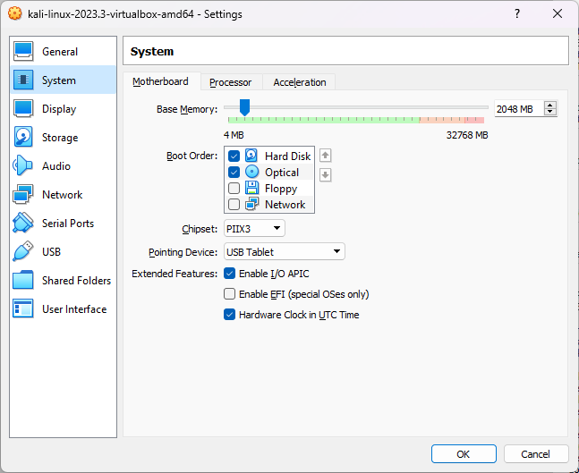

# Setting up your Kali Linux VM

Let's get started setting up your Kali Linux virtual machine.

## Why?

Kali Linux is a distribution of Linux that comes with many valuable tools for ethical hacking.

{style="width: 50%; margin:0 35% 0 15%; display: block;"}

<!-- more -->

## What is a VM?

A virtual machine (VM) is a virtual computer running inside your computer. We use virtual machines for a couple of reasons:

1. To use a different operating system than is on our computer. For example, many tools we need to use are available on Linux, but many of us use Windows or Mac.
2. To protect ourselves. Sometimes, we may be running code which we are not 100% sure is safe. Keep your personal information safe by running it in a VM.

## What software run VMs?

Virtual machines are run using virtualization software. There are two free-to-use products you can choose from:

1. VirtualBox. Open-source and free. [Downloads available here](https://www.virtualbox.org/wiki/Downloads).
2. VMware Workstation Player. Not open-source, but free for personal, non-commercial use. [Downloads available here](https://www.vmware.com/ca/products/workstation-player.html).

You may choose either software to install. Both options are practically equivalent regarding features, and the difference is opinion-based.

{style="width: 50%; margin: auto; display: block;"}

Choose the next section based on which software you decided to install.

### Installing VirtualBox

{ width=50% }

First, [download VirtualBox from here](https://www.virtualbox.org/wiki/Downloads).

Open the installer file.

Click **Next**.

Leave the feature selection as default. Click **Next**.

Click **Yes**.

Click **Install**.

Wait for the installation to complete.

The installation is done, you can click **Finish**.

Now you can launch VirtualBox from the desktop or start menu.

### Installing VMware

First, [download VMware Workstation Player from here](https://www.vmware.com/ca/products/workstation-player.html).

Open the installer file.

Click **Next**.

~~Read the EULA~~ and click accept. Then click **Next**.
m

Check **Install Windows Hypervisor Platform (WHP) automatically**. Click **Next**.

Click **Next**.

Uncheck **Join the VMware Customer Experience Improvement Program** if you want to. Click **Next**.

Click **Next**.

Click **Install**.

Wait for VMware to finish installing.

The installation is done, you can click **Finish**.

Now you can launch VMware from the desktop or start menu. If prompted, select the non-commercial option.

## How do I get a Kali Linux VM?

You can download pre-built Kali virtual machines from the Kali Linux website. [Download the VM matching your chosen software (VMware or VirtualBox).](https://www.kali.org/get-kali/#kali-virtual-machines)

## How do I install a Kali Linux VM?

Extract the downloaded archive to a folder you will remember. Common virtual machine folders are:

- `C:\Users\[username]\VirtualBox VMs`
- `C:\Users\[username]\Documents\Virtual Machines`
- `C:\VirtualBox VMs`

After you have extracted the virtual machine, you must open it.

If you are using VirtualBox, simply double-click the `kali-linux-...-virtualbox-amd64.vbox` file.

If you are using VMware:

1. Open VMware.
2. Click **Open a Virtual Machine**.
3. Navigate to the folder where you extracted the VM.
4. Select the `kali-linux-...-vmware-amd64.vmx` file.
5. Click **Open**.

After you have opened the file once, you can simply launch the VM from the VM software going forward.

You may wish to increase the amount of RAM and CPU threads allocated to the VM to improve its performance.

Simply right click on your virtual machine and click **Settings**.

Now your VM is installed and ready to be ran.

## How do I run a Kali Linux VM?

With your newly installed VM, click **Run** or **Start** in your preferred VM software.

**Note:** Once you click on your VM, it will capture your keyboard and mouse. To get out of the VM, click:

- **Right Ctrl** if using VirtualBox.
- **Ctrl + Alt** if using VMware.

When met with the login screen, the default username and password are both `kali`.

One final recommendation is to install the package `kali-linux-large`, which contains many useful tools. You can install the package by opening a terminal and running the following commands:

1. `sudo apt update`
2. `sudo apt -y install kali-linux-large`

When prompted, enter the password in the terminal.

## What now?

Feel free to explore the operating system and tools within it. Plenty of free materials on the internet can help guide you. We plan to post more club training materials soon. We will also be using Kali extensively in our club meetings.

Happy Hacking!
